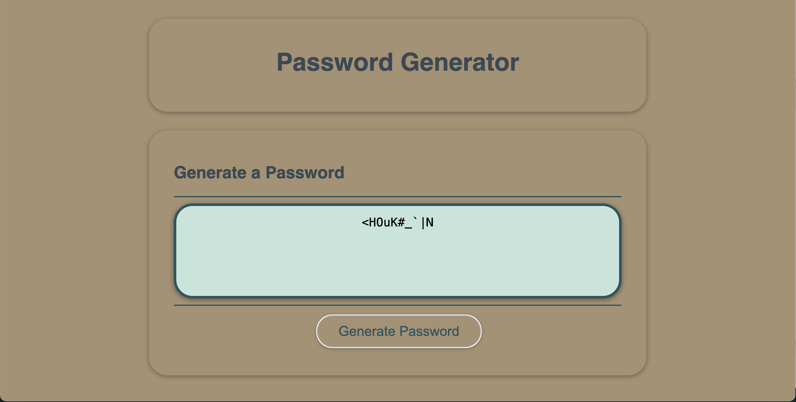

# Password-Generator

## Description

Password Generator is an application that an employee can use to generate a random password based on criteria they've selected.

[](https://opensource.org/licenses/MIT)

## Table of Contents:

- [Overview](#Overview)
- [Challenge](#Challenge)
- [User Story](#User-Story)
- [Acceptance Criteria](#Acceptance-Criteria)
- [Mock Up Image](#Mock-Up-Image)
- [Installation Instructions](#Installation-Instructions)
- [Usage Instructions](#Usage-Instructions)
- [Technologies Used](#Technologies-Used)
- [Deployed Application Link](#Deployed-Application-Link)
- [Video Location](#Video-Location)
- [Screenshots](#Screenshots)
- [Test](#Test)
- [Questions](#Questions)
- [Credits](#Credits)
- [License](#License)

# Overview

## Challenge
"This week's Challenge requires you to create an application that an employee can use to generate a random password based on criteria they've selected. This app will run in the browser, and will feature dynamically updated HTML and CSS powered by JavaScript code that you write. It will have a clean and polished user interface that is responsive, ensuring that it adapts to multiple screen sizes."

## User Story

```md
AS an employee with access to sensitive data,
I want to randomly generate a password that meets certain criteria
so that I can create a strong password that provides greater security.
```

### Acceptance Criteria

```md
It's done when I click the button to generate a password, and I am presented with a series of prompts for password criteria.
It's done when I select which criteria to include in the password.
It's done when I choose a length of at least 8 characters and no more than 128 characters.
It's done when I confirm whether or not to include lowercase, uppercase, numeric, and/or special characters.
It's done when I answer each prompt, and my input should be validated and at least one character type should be selected.
It's done when all prompts are answered, and a password is generated that matches the selected criteria.  
It's done when the password is generated, and displayed in an alert or written to the page.
```
## Mock-Up Image 

The following image shows the desired web application's appearance:


## Installation Instructions

This is an online Web Application deployed through GitHub, hence it doesn't need user's installation.

## Usage Instructions
1. Open the web page using the link provided further in this README file, 
2. Click on Generate Password, 
3. Select the number of characters that you want to password to have, 
4. Answer the following questions.
5. Copy and use your new password.

## Technologies Used
- Visual Studio Code: [Website](https://code.visualstudio.com/)

## Deployed Application Link
[Password Generator](https://fibarrafdec.github.io/Password-Generator/)

## Video Location
[Password Generator Video](https://drive.google.com/file/d/1R6NRpe4pMOK9JB1kgCAGB3fPqX-PpQEA/view?usp=sharing)

## Screenshots




## Test
This application has been tested running it after deployment with GitHub.

## Questions?

If you have any questions related with this Password Generator, feel free to reach me through:

Email:[fibarrafdec@gmail.com](fibarrafdec@gmail.com)

GitHub username:[fibarrafdec](fibarrafdec)
GitHub link: https://github.com/fibarrafdec

## Credits
This application has been created by © 2023 Fernando Ibarra [fibarrafdec](https://github.com/fibarrafdec).

## License & Copyright ©
This application is covered under the MIT License.
[](https://opensource.org/licenses/MIT)

### Copyright © 2023 Fernando Ibarra
```md
Permission is hereby granted, free of charge, to any person obtaining a copy
of this software and associated documentation files (the "Software"), to deal
in the Software without restriction, including without limitation the rights
to use, copy, modify, merge, publish, distribute, sublicense, and/or sell
copies of the Software, and to permit persons to whom the Software is
furnished to do so, subject to the following conditions:

The above copyright notice and this permission notice shall be included in all
copies or substantial portions of the Software.

THE SOFTWARE IS PROVIDED "AS IS", WITHOUT WARRANTY OF ANY KIND, EXPRESS OR
IMPLIED, INCLUDING BUT NOT LIMITED TO THE WARRANTIES OF MERCHANTABILITY,
FITNESS FOR A PARTICULAR PURPOSE AND NONINFRINGEMENT. IN NO EVENT SHALL THE
AUTHORS OR COPYRIGHT HOLDERS BE LIABLE FOR ANY CLAIM, DAMAGES OR OTHER
LIABILITY, WHETHER IN AN ACTION OF CONTRACT, TORT OR OTHERWISE, ARISING FROM,
OUT OF OR IN CONNECTION WITH THE SOFTWARE OR THE USE OR OTHER DEALINGS IN THE
SOFTWARE.
```
